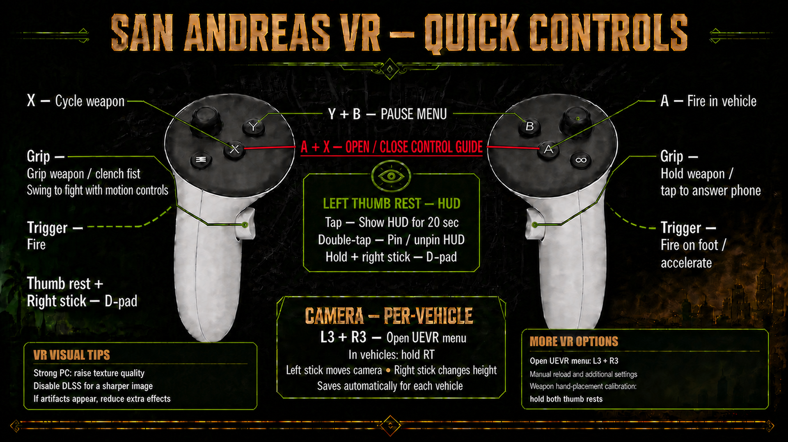

# SAN ANDREAS VR DEFINITIVE EDITION

<p align="center">
  <a href="Documentation/Quest3-Control-Layout.png">
    
  </a>
</p>

> **PRE-RELEASE BETA v0.3.6** - Click the control guide above to open the full-resolution image.

Added left-handed mode support—toggle it in the improved quick settings.

Want to walk through San Andreas instead of looking at it through a flat screen? This mod turns **Grand Theft Auto: San Andreas - The Definitive Edition** into a much clearer, more physical, and more immersive VR experience through Praydog's UEVR.

The included profile is tuned for sharp visuals and good performance, with plenty of headroom left for stronger PCs to turn the graphics up. The HUD hides itself when you do not need it, the controls are built around Quest motion controllers, and the control guide is available both at startup and in VR.

The big difference is how physical the game feels:

- **All aimable weapons are motion tracked:** point, aim, and fire with your controllers instead of dragging a flat-screen crosshair around.
- **Independent VR akimbo:** dual-wield supported pistols, sawn-off shotguns, Micro Uzis, and Tec-9s with separate trigger, muzzle, and aim ownership for each hand.
- **Physics-based throwables:** grip and physically throw grenades and Molotovs with controller momentum while GTA retains the native explosion, fire, damage, sound, and reaction package at impact.
- **Two-handed aiming and stabilization:** grip rifles and shotguns with both hands, steady the rear grip, and use the forward hand to guide the barrel.
- **Animated VR hands:** controller-tracked open, grip, trigger, and clenched-hand poses keep the hands feeling connected to what you are doing.
- **Refined, accurate melee:** swing bats and melee weapons, punch with either fist, and fight with a melee weapon in one hand while the other hand fights freely.
- **Punch and melee weapon sound effects:** hits feel physical, with distinct feedback for fists, knuckles, blunt weapons, sharp weapons, and vehicles.
- **Excellent vehicle free aim:** aim and fire from supported cars and bikes while keeping driving controls available.
- **Vehicle free-aim fixes:** vehicle firing works again, with infinite vehicle free-aim ammo restored.
- **Great-feeling driving controls:** drive, steer, accelerate, brake, and use vehicle weapons without fighting the VR controls.
- **Custom refined flight controls:** aircraft handling, Hydra VTOL support, and landing-gear camera feedback are tuned separately from ground vehicles.
- **Vehicle cameras that remember you:** calibrate a car or other vehicle once and its camera position is saved and recalled automatically every time you get back in. Many cars, bikes, boats, and aircraft already have tuned profiles.
- **Original GTA vehicle camera modes:** hold the left Quest menu button in a road vehicle to cycle GTA's native close and exterior views without remapping steering, acceleration, or weapon controls.
- **Quick ground-weapon swaps:** tap the right grip—or use R3—while standing over GTA's pickup prompt to replace a same-slot weapon even when the HUD is hidden.
- **Natural weapon handling:** drop weapons into magnetic waist holsters, recall them per weapon, and keep two-hand grips stable through regrips.
- **A cleaner VR interface:** auto-hiding HUD, A+X control guide, touch/D-pad shortcuts, phone grip tap, and Quest-friendly pause controls.
- **More controller options:** controllers without thumb-rest input can use R3 + right stick for D-pad and HUD controls.
- **Reliable result screens:** fixed invisible Mission Failed, Wasted, Busted, and similar screens, plus loss of controls on those screens.
- **Broader diagnostics:** expanded input-loss debugging makes controller problems easier to investigate.
- **Weapon-skill compatibility:** motion-tracked weapons now remain correctly held when GTA upgrades their weapon skill.
- **Sharper, clearer visuals:** improved textures, scope and muzzle presentation, cleaner effects, and graphics settings that leave room for extra quality.

This is still beta software, so back up your existing UEVR `SanAndreas` profile before installing. A few missions, unusual vehicles, and weapon combinations may still need refinement.

## Requirements

- A legally installed copy of GTA San Andreas – The Definitive Edition for Windows.
- **Recommended UEVR version:** [UEVR Nightly 01127](https://github.com/praydog/UEVR-nightly/releases/tag/nightly-01127-6f66affc01cea22e4b1b5a47986e1ade80ccbd26), full build name `UEVR Nightly 01127 (6f66affc01cea22e4b1b5a47986e1ade80ccbd26)`. This is the exact build used to develop and test the mod. Newer UEVR nightlies are not yet validated and may introduce injection, input, rendering, or UI compatibility changes. The package does **not** include UEVR or game files.
- OpenXR and Quest Touch-style controls are the primary tested setup.
- Supported executable used during development: `SanAndreas.exe` SHA-256 `CF677214A8AB317B3BC8811C64BBC60742204D021132C79E7C0583322CF5BA17`.

## Downloads

The release uses stable download names so links do not change between updates:

- **`San-Andreas-VR-DE-Manual.zip`** - manual installation and VRHub automation.
- **`San-Andreas-VR-DE-Installer.zip`** - installer with `Auto Detect` and `Manual Path` modes.

Open `VERSION.txt` inside an archive for its exact version and key hashes; `SHA256SUMS.txt` covers every packaged file.

The Quest 3 layout is included as `Documentation/Quest3-Control-Layout.png` in both archives, displayed prominently above, and available in VR through the A+X control-guide shortcut.

See [CHANGELOG.md](CHANGELOG.md) for the full change history.

## What you get in VR

### Weapons and hands

- **All aimable weapons are motion tracked:** point, aim, and fire with your controllers instead of dragging a flat-screen crosshair around.
- **Two-handed aiming and stabilization:** grip rifles, shotguns, and other long weapons with both hands and steady the rear grip while the forward hand guides the barrel.
- **Animated controller-tracked hands:** open, grip, trigger, and clenched-hand poses follow what you are actually doing.
- **Independent akimbo:** Pistol, Sawn-off Shotgun, Micro Uzi, and Tec-9 can be held and fired independently in both hands with per-hand aim and muzzle presentation.
- **Motion throwables:** physically throw grenades and Molotovs from either controller; hand momentum drives the visible flight and GTA supplies the native explosion, fire, damage, audio, and world reactions at impact.
- **Refined physical melee:** fists, brass knuckles, bats, and melee weapons support independent left/right hand fighting, including a melee weapon in one hand and a fist in the other.
- **Punch and melee weapon sound FX:** clear contact feedback for fists, knuckles, blunt weapons, sharp weapons, and vehicle impacts.
- **Natural holsters:** drop weapons into lowered magnetic waist positions, keep their remembered per-weapon placement, and regrip without losing the correct hand relationship.
- **Sniper and long-gun polish:** usable scope presentation, steadier two-hand handling, improved muzzle presentation, and cleaner weapon visibility.

### Cars, bikes, boats, and aircraft

- **Free aim in cars:** aim and fire supported vehicle weapons while keeping acceleration and driving controls available.
- **Great-feeling driving controls:** steering, acceleration, braking, vehicle hands, bicycle pedals, motorbike handling, and vehicle firing are separated so they do not fight each other.
- **Camera calibration that sticks:** open the UEVR camera controls, position the view once, and the mod saves it per vehicle model and restores it automatically on future entries.
- **Native vehicle camera cycling:** hold the left Quest menu button in a car, boat, or motorbike to use GTA's original Back/View camera cycle; a short press still opens Pause, and on-foot first person remains locked.
- **Many pre-calibrated vehicles:** tuned profiles are included for a broad set of cars and other vehicle types; uncalibrated models fall back safely and can be adjusted the same way.
- **Custom refined flight controls:** aircraft controls stay native where appropriate, with Hydra VTOL support, aircraft-specific input handling, and brief exterior-camera feedback for supported landing-gear changes.
- **HMD-oriented movement support:** use the UEVR body/movement option that suits your standing or seated setup while retaining stick locomotion.

### Comfort, controls, and presentation

- **Auto-hiding HUD for maximum immersion in sunny San Andreas:** show it with the left touch, pin or unpin it with a double-tap, and use the touch modifier with the right stick for contextual D-pad actions.
- **Alternate D-pad mode:** switch to R3 + right stick when your controllers do not provide thumb-rest input; the same control handles HUD tap and pin actions without moving the camera.
- **In-game control guide:** A+X opens the Quest 3 layout and quick VR options without needing to leave the game.
- **Useful interaction shortcuts:** phone answering, pause controls, camera switching, weapon cycling, vehicle fire, and aircraft-specific controls are mapped for motion controllers.
- **Context-aware pickup control:** a quick right-grip tap or R3 sends GTA's native on-foot context action for phone calls and same-slot ground-weapon swaps without changing held-grip behavior.
- **Sharper high-definition VR:** improved textures, scope and reticle clarity, cleaner effects, better muzzle flashes, and graphics settings with headroom for stronger PCs.
- **Installer safety:** Auto Detect and Manual Path modes, OneDrive-aware profile handling, backups, guarded single-instance launching, and package hashes help protect existing settings.

Physical grenade and Molotov throwing is enabled in this beta. Tear gas, satchel charges, and the detonator remain on their native GTA paths.

## Installer

1. Close GTA San Andreas DE and UEVR.
2. Extract the installer archive completely.
3. Run `INSTALL-SAVR.bat`.
4. Choose:
   - `1 — Auto Detect`: checks common Steam, Rockstar, Epic, and game-library locations.
   - `2 — Manual Path`: paste the GTA San Andreas DE folder containing `Gameface`.
5. Confirm the detected paths. The installer backs up the existing UEVR profile and GTA settings before copying files.

The installer resolves Windows' real Documents known folder, including OneDrive redirection, and installs the tested GTA VR settings with Free Aim. It backs up the existing UEVR profile, GTA settings, and every game-folder file it replaces—including the original startup movie. Use the advanced `-SkipGameSettings` switch only if you deliberately want to retain your existing GTA graphics/gameplay configuration.

Launch through the installed **GTA San Andreas DE VR** desktop, Start-menu, or taskbar shortcut. SAVR's guarded launcher prevents rapid double-clicks from starting two game instances and saves `GameUserSettings.SAVR-last-launch.ini` before each launch. The installer also upgrades existing user shortcuts and taskbar pins that point to the detected game executable. Do not pin or launch the raw `SanAndreas.exe` directly, because Windows shortcuts cannot intercept a direct executable launch without unsafe game-file or system-level modification.

The installer never installs UEVR or the game.

## Manual installation

Close the game and UEVR first.

### 1. UEVR profile

Copy the contents of:

```text
UnrealVRMod\SanAndreas\
```

to:

```text
%APPDATA%\UnrealVRMod\SanAndreas\
```

The runtime plugin must end up at:

```text
%APPDATA%\UnrealVRMod\SanAndreas\plugins\UEVR_GTASADE.dll
```

Lua scripts must end up under:

```text
%APPDATA%\UnrealVRMod\SanAndreas\scripts\
```

### 2. Texture PAKs

Copy:

```text
GameFolder\Gameface\Content\Paks\~mods\
```

into the GTA San Andreas Definitive Edition installation folder, preserving the `Gameface\Content\Paks\~mods` path.

### 3. Recommended GTA settings

The manual archive contains:

```text
GameSettings\GameUserSettings.ini
```

Press `Win+R`, enter `shell:Personal`, and open:

```text
Rockstar Games\GTA San Andreas Definitive Edition\Config\WindowsNoEditor\
```

Back up the existing file, then copy the packaged `GameUserSettings.ini` there. Using `shell:Personal` is important because Windows may redirect Documents into OneDrive.

### 4. Startup guide and control image

The package replaces the Rockstar startup stinger with a 30-second control-guide version. Manual installers should back up this file first:

```text
Gameface\Content\Movies\1080\GTA_SA_RSTAR_STINGER_FINAL_1920x1080.mp4
```

The same full-resolution layout is included under `Documentation` and in the UEVR profile for the A+X in-game guide.

## First launch

1. Start GTA San Andreas DE.
2. Start UEVR and inject into `SanAndreas`/`Gameface` using OpenXR.
3. The included profile, bindings, plugin, and Lua scripts load automatically.
4. Use the separate SA Improved Settings utility for optional and experimental flags.

See [CONTROLS.md](CONTROLS.md) and [FEATURES.md](FEATURES.md).

## Support and recovery

Run **`OPEN SAVR SUPPORT TOOL.bat`** beside this README to disable diagnostics, re-enable the in-game diagnostics selector, create a privacy-scrubbed local support ZIP, or open the UEVR log folder. Nothing is uploaded automatically. Installer users also receive the same clearly named launcher under `Documents\San Andreas VR`; the file beginning with `_INTERNAL` is not meant to be opened directly.

The in-game A+X guide offers session-only `Off`, `Vehicle Input`, `Save/Load`, and `Full` diagnostics. A crash or interrupted session leaves a marker for the support ZIP and the next launch safely starts with diagnostics Off. `SAVR Emergency Diagnostics Switch.ini` provides an emergency `ForceOff=true` override that the running plugin checks without requiring a restart.

## Questions and bug reports

For questions, bug reports, feedback, or other help, send a direct message on X to [@Yobrohy2o](https://x.com/Yobrohy2o).

## Updating and uninstalling

- Installer updates create timestamped profile, GTA-settings, and replaced-game-file backups under `%APPDATA%\UnrealVRMod\_Backups`.
- The installer also backs up the active GTA settings and leaves `GameUserSettings.SAVR-recommended.ini` beside the active file for quick recovery if GTA runs first-launch defaults again.
- Personal vehicle camera and grip calibration files should be copied somewhere safe before replacing the profile.
- To uninstall manually, restore your prior `SanAndreas` profile and remove only the two packaged PAKs from the game's `~mods` folder.

## Building from source

Use Visual Studio 2022 Build Tools and build `UEVR_GTASADE.sln` as `Release|x64`. Visual Studio 18/2026 currently resolves incompatible C++ target paths for this project.

The repository source tree and downloadable runtime archives are intentionally separate. Generated intermediates, PDBs, logs, crash dumps, personal profiles, saves, and internal development snapshots are not release files.

## Credits and license

- Based on [Holydh/UEVR_GTASADE](https://github.com/Holydh/UEVR_GTASADE), licensed under MIT.
- UEVR by Praydog.
- Scope work builds on Mutar's shared UEVR scope techniques.
- Thanks to the Flat2VR/UEVR modding community and project testers.

This repository is distributed under the included [MIT License](LICENSE). Grand Theft Auto, Rockstar Games, and related assets are trademarks/property of their respective owners. No original game executable or game-owned data is included.
